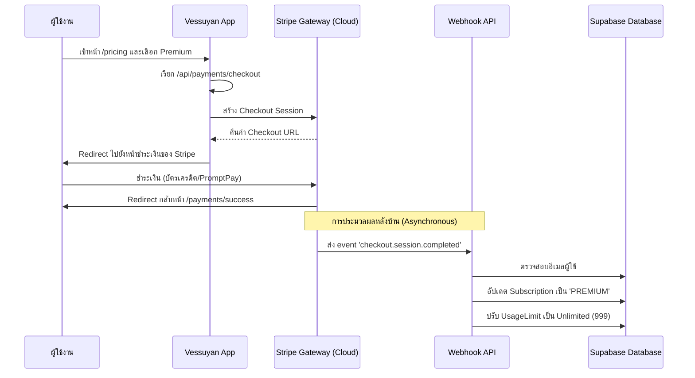

# 💳 Stripe Automated Payment System Setup

เอกสารนี้ระบุถึงโครงสร้างและการทำงานของระบบชำระเงินอัตโนมัติ (Automated Subscription) ในโปรเจกต์ Vessuyan

## 🌊 การไหลของข้อมูล (Payment Flow)

## 🛠️ ส่วนประกอบทางเทคนิค

### 1. Frontend Integration
- **Pricing Page (`/pricing`):** หน้าแสดงราคาและสิทธิประโยชน์
- **Success Page (`/payments/success`):** หน้าแจ้งผลการชำระเงินสำเร็จ

### 2. Backend API Roles
- **Checkout Route (`/api/payments/checkout`):** 
    - ตรวจสอบ Session ผู้ใช้
    - สร้าง Session ใน Stripe
    - ระบุ `metadata` (email/tier) เพื่อใช้ยืนยันตอนจ่ายเงินเสร็จ
- **Webhook Route (`/api/payments/webhook`):** 
    - **หัวใจสำคัญ:** รับการคอนเฟิร์มจาก Stripe
    - ตรวจสอบ Signature เพื่อความปลอดภัย
    - ทำการอัปเดตสิทธิ์ในฐานข้อมูลโดยตรง

## 🗝️ การตั้งค่าระบบ (Required Configuration)

เพื่อให้ระบบทำงานได้สมบูรณ์ ต้องตั้งค่าในไฟล์ `.env` ดังนี้:

- `STRIPE_SECRET_KEY`: ได้มาจาก Stripe Dashboard (Mode Test หรือ Live)
- `STRIPE_WEBHOOK_SECRET`: ได้มาจากการสร้าง Webhook endpoint ใน Stripe Dashboard โดยชี้มาที่ `https://your-domain.com/api/payments/webhook`
- `NEXTAUTH_URL`: ความเป็นจริงต้องระบุ URL ของ Production เพื่อให้ Stripe redirect กลับมาถูกหน้า

## 📈 แผนในอนาคต
- **AI Slip Verification:** สำหรับการโอนเงินโดยตรง (Manual Transfer) โดยใช้ Gemini Vision วิเคราะห์สลิป และให้ Admin กดยืนยันในหน้า Dashboard
